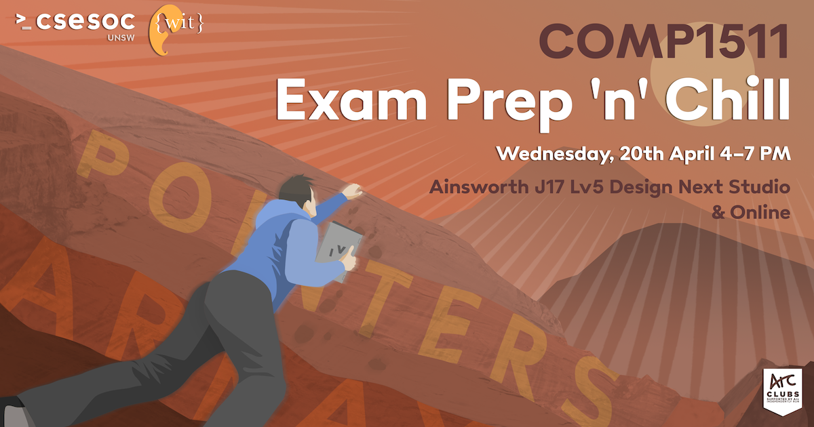

## COMP1511 Exam Prep n' Chill (T1, 2022)

Welcome to the repository for the event! This monorepo houses the site and solution code.

### Contributing (CSESoc Education, Competitions, UNSW WIT)

For each question you upload, **both** the solution code and a brief explanation must be provided. Please read the README.md in [/solutions](solutions/README.md) and [/site](site/readme.md) for more info.

**Your tasks**  
[] Read the README.md in [/solutions](solutions/README.md) and [/site](site/readme.md).  
[] Read the [contributing.md](site/contributing.md) in /site and install the required prereqs.  
[] Clone the repository locally to work with it and checkout to a separate branch to work with it in isolation (see [contributing.md](site/contributing.md) in /site).  
[] Once you’ve finished coding up your solution, add it to /solutions following the instructions in the [README.md](solutions/README.md) in /solutions.  
[] Then, write a quick explanation and add your question, explanation and sample code to the site following the instructions in the [README.md](site/readme.md) in /site.  
[] Commit your changes and open a pull request. Your solutions and explanations will be added to the repository and pushed to the site automatically!
